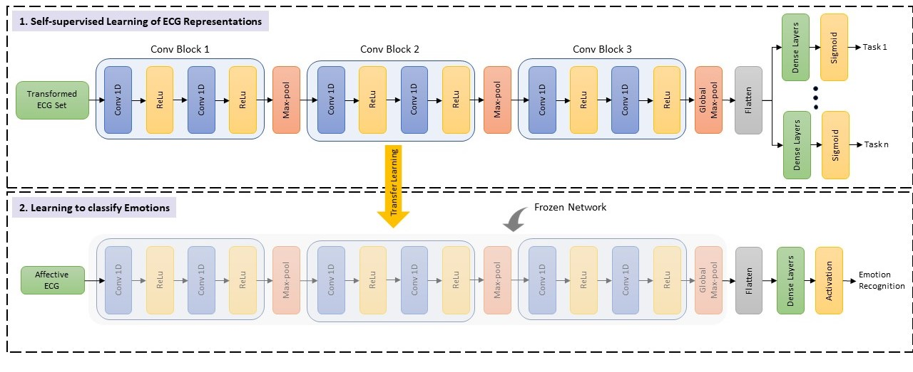

# "Self-supervised ECG Representation Learning for Emotion Recognition" (TF v1.14.0)

Folllowing are the papers associated with this project: 

**Journal version:** [Self-supervised ECG Representation Learning for Emotion Recognition](https://ieeexplore.ieee.org/document/9161416)
Authors: [Sarkar](https://www.pritamsarkar.com/) and [Etemad](https://www.alietemad.com/)

**Conference version:** [Self-Supervised Learning for ECG-Based Emotion Recognition](https://ieeexplore.ieee.org/abstract/document/9053985)
Authors: [Sarkar](https://www.pritamsarkar.com/) and [Etemad](https://www.alietemad.com/)

## Proposed architecture


## Requirements

- Python >=3.6
- TensorFlow = 1.14.0
- TensorBoard = 1.14.0
- Scikit-Learn = 0.22.2
- NumPy = 1.18.4
- Tqdm = 4.36.1
- Pandas = 0.25.1
- Mlxtend = 0.17.0

## Usage

- **implementation:** this directory contains all of our source codes.
    - Please create similar directory structure in your working directory:
        - *data_folder*: Keep your data in numpy format here.
        - *implementation*: Keep the [codes](./implementation) here.
        - *summaries*: Tensorboard summaries will be saved here.
        - *output*: Loss and Results will be stored here.
        - *models*: Self-supervised models will be stored here.
<br />

- **load_model:** this directory contains the pretrained self-supervised model and sample codes to use it.
    - The saved pretrained model can be used in order to extract features from raw ECG signals, which can be further used to perform downstream tasks.
    - We provide sample code for the above: [extract_features.py](./load_model/extract_features.py).
    - In order to extract features, the input arrays must be in format of *batch_size x window_size*. We selected *window_size of 10 seconds X 256 Hz = 2560 samples*, where 256 Hz refers to the sampling rate. A sample ECG signal is given [here](./load_model/sample_ecg.npy).
    - We also provide sample code in order to save the weights of our pretrained network: [save_weights.py](./load_model/save_weights.py)

- **tips:**
    - Try using larger batch size in the downstream task, that would boost performance. 
    - Try full fine-tuning rather than fc-tuning (which I did) to boost up performance.
    - Try using larger batch for pre-training as well, this may help!

- **note:**
    - I have received few emails and messages regarding missing processed data. As per the EULA of the original dataset, I am not allowed to share the processed data, so I could not upload them in this repo. Originally, I processed the datasets in Matlab separately, I added separately the preprocessing codes in written in Python, you may use this as reference: https://github.com/pritamqu/SSL-ECG/issues/1#issuecomment-1114038816.

## Citation

Please cite our papers for any purpose of usage.
```
@misc{sarkar2020selfsupervised,
    title={Self-supervised ECG Representation Learning for Emotion Recognition},
    author={Pritam Sarkar and Ali Etemad},
    year={2020},
    eprint={2002.03898},
    archivePrefix={arXiv},
    primaryClass={eess.SP}
}

@INPROCEEDINGS{sarkar2019selfsupervised,
  author={P. {Sarkar} and A. {Etemad}},
  booktitle={ICASSP 2020 - 2020 IEEE International Conference on Acoustics, Speech and Signal Processing (ICASSP)}, 
  title={Self-Supervised Learning for ECG-Based Emotion Recognition}, 
  year={2020},
  volume={},
  number={},
  pages={3217-3221},}
  
```

### Question
If you have any query or want to chat with me regarding our work please reach me at <pritam.sarkar@queensu.ca> or connect me in [LinkedIN](https://www.linkedin.com/in/sarkarpritam/).
